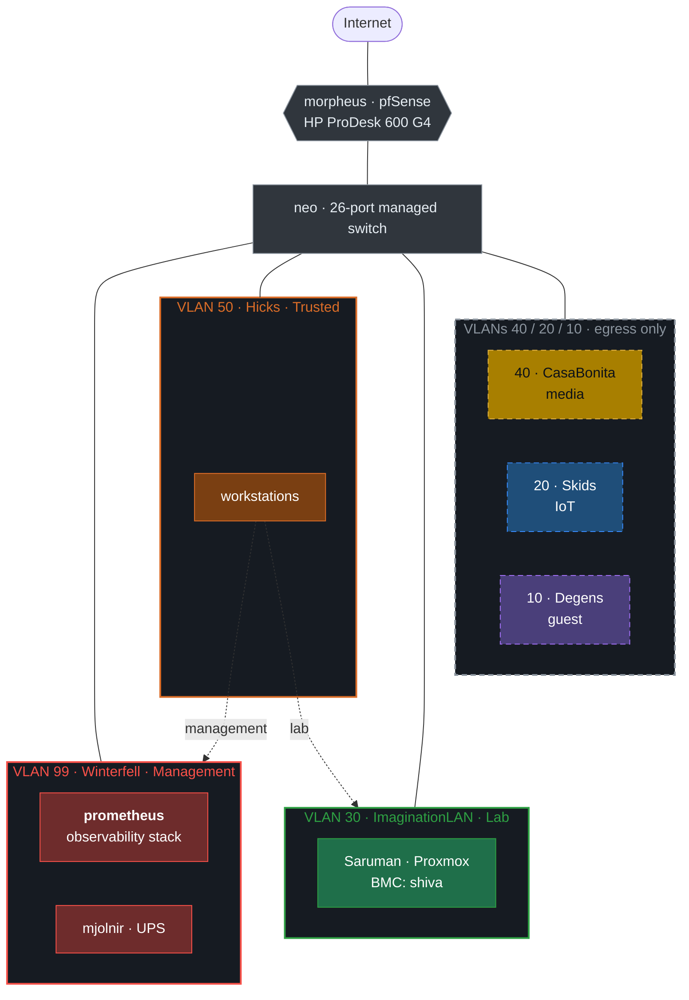

<div align="center">

# HomeLab

**A segmented home network and its observability stack, managed as code.**

[](https://github.com/Gerrrt/HomeLab/actions/workflows/ci.yml)
[](LICENSE)
[](https://github.com/getsops/sops)
[](https://github.com/FiloSottile/age)
[](https://prometheus.io)
[](https://grafana.com/oss/grafana/)
[](https://grafana.com/oss/loki/)
[](https://www.pfsense.org)

[Architecture](docs/architecture.md) ·
[Network](docs/network.md) ·
[Observability](docs/observability.md) ·
[Security](SECURITY.md) ·
[Runbooks](docs/runbooks) ·
[Decisions](docs/adr) ·
[Roadmap](docs/roadmap.md)

</div>

---

Seven VLANs behind a pfSense firewall, default-deny between every segment, with
a Prometheus/Loki/Grafana stack watching all of it. Every config in this
repository is the config that runs, validated on every push.

It started as a place to practise security work and turned into the network the
house actually depends on, which changed the requirements considerably — a
broken experiment is a learning opportunity, a broken DHCP server is a domestic
incident.

## Highlights

- **Network segmented by trust, not by function.** Seven VLANs; IoT, media and
  guest segments are terminal — egress only, no path to anything else, and each
  carries a tripwire that logs anything which gets past that. Default deny holds
  everywhere except the trusted workstation segment and the switch LAN, both of
  which are listed rather than counted.
  [Why](docs/adr/0013-segment-access-as-implemented.md)
- **Full observability pipeline for a mixed estate.** Grafana Alloy agents push
  metrics and logs from Linux hosts; `snmp_exporter` polls the four devices that
  can't run an agent (firewall, switch, UPS, iLO). One agent config, deployed
  identically everywhere. [How](docs/architecture.md#observability-data-flow)
- **Dashboards and alerting as code.** 7 provisioned dashboards, 140 panels, and
  70 alert rules — 54 metric-based in Prometheus, 16 log-based in Loki — sharing
  one Alertmanager routing tree. No dashboard exists only in a database.
- **Secrets encrypted in-repo with SOPS + age.** Per-device credentials,
  decrypted at deploy time into gitignored paths, with `git log` showing which
  credential rotated and when — but never to what.
  [Why](docs/adr/0005-secrets-with-sops-and-age.md)
- **CI that actually validates the infrastructure.** `docker compose config`,
  `promtool`, `amtool`, `alloy fmt`, a real Loki boot to parse the LogQL rules,
  dashboard-JSON and datasource checks, every dashboard's PromQL parsed, plus
  `gitleaks` over the full history.
- **CI that validates the documentation too.** Six assertions cross-check
  this prose against the configs it describes — rule and panel counts, the
  SNMP inventory against `docs/network.md`, the host/stack and ports tables
  against `compose.yaml`, and a ban on image versions in prose — Dependabot
  edits only `compose.yaml`, so a version written anywhere else is stale
  from the next bump. A document that disagrees with the repository fails
  the build.
- **Supply chain pinned by digest.** Every image carries both a tag and a
  `sha256:` digest, so a moved tag cannot change what deploys. CI enforces it;
  `make pin-digests` re-resolves them from the registry. Every `docker run` in
  the Makefile, the scripts, the workflow and the runbooks resolves its image
  from `compose.yaml` too, so an image that is not pinned there cannot be run
  at all.
- **Documented decisions and runbooks.** Fourteen ADRs covering what was chosen
  and what was rejected — including the costs accepted knowingly; twelve
  runbooks for the operations that are easy to get wrong at 1am.

## Architecture



Dotted lines are the paths this diagram draws, and they are not the whole story.
Default deny holds for every segment except Hicks and the switch LAN, both of
which reach further than any diagram of exceptions suggests — so what a segment
can actually reach is recorded per segment in
[`network.md`](docs/network.md)'s *Reaches* column, which is the document to
read for the current state.
[ADR-0013](docs/adr/0013-segment-access-as-implemented.md) holds the method and
the reasoning, and describes the ruleset as it stood on 2026-09-01; the Hicks
interface was narrowed the day after. A count was the wrong instrument and this
README carried the wrong count for months. Segment colour matches the patch
cable in the rack; a dashed border means egress only.
Full topology and data flow in [`docs/architecture.md`](docs/architecture.md).

## Stack

| Layer | Tool | Role |
| --- | --- | --- |
| Firewall / routing | [pfSense on FreeBSD 15](docs/network.md) | VLANs, DHCP, default-deny |
| Virtualisation | Proxmox VE | Lab hypervisor |
| Metrics | [Prometheus](stacks/observability/prometheus) | 30-day retention capped at 12 GiB, remote-write receiver |
| Logs | [Loki](stacks/observability/loki) | Single-binary, filesystem storage |
| Collection | [Grafana Alloy](stacks/observability/alloy) | node + cAdvisor metrics, Docker/journal/syslog/auth logs |
| Network polling | [snmp_exporter](stacks/observability/snmp-exporter) | pfSense, switch, UPS, iLO |
| Alerting | [Alertmanager](stacks/observability/alertmanager) | Severity routing, inhibition |
| Visualisation | [Grafana](stacks/observability/grafana) | 7 provisioned dashboards |
| Secrets | [SOPS + age](secrets) | Encrypted in-repo |
| CI | [GitHub Actions](.github/workflows/ci.yml) | Lint, config validation, secret scanning, digest pinning |

## Repository layout

```text
.
├── stacks/observability/     # the deployed stack — one compose file, six services
│   ├── compose.yaml
│   ├── prometheus/           # config, file_sd targets, 54 alert rules
│   ├── alertmanager/         # routing and inhibition
│   ├── loki/                 # single-binary config + 16 LogQL rules
│   ├── alloy/                # the agent config directory, shipped to every host
│   ├── snmp-exporter/        # generator.yaml is the source of truth
│   └── grafana/              # provisioning + 7 dashboards
├── stacks/lab/               # the lab's own stack — four services, not yet deployed
│                             #   runs on a guest on Saruman, never remote-writes
│                             #   to VLAN 99. See its README and ADR-0020
├── secrets/                  # SOPS-encrypted; see secrets/README.md
├── scripts/                  # bootstrap, render, validate, pin-digests, purge
├── SECURITY.md               # disclosure policy and known exposure
├── docs/
│   ├── architecture.md  network.md  hardware.md
│   ├── observability.md  security.md  roadmap.md
│   ├── adr/                  # 23 architecture decision records
│   └── runbooks/             # deploy, converge, add device, rotate creds, certs,
│                             #   key backup, purge, restore the firewall,
│                             #   restore the stack, ship firewall logs,
│                             #   verify the alert path, enable suricata,
│                             #   fit the UPS battery, add a host override,
│                             #   build the lab guest
└── Makefile                  # make help
```

## Quick start

Requires Docker with the compose plugin, plus [`sops`](https://github.com/getsops/sops),
[`age`](https://github.com/FiloSottile/age) and `openssl`.

```bash
git clone https://github.com/Gerrrt/HomeLab.git && cd HomeLab

make secrets-init     # generate an age keypair, create the encrypted secrets file
make secrets-edit     # fill in real values
make certs ARGS=--ca  # create the lab CA
make certs ARGS="--host grafana.matrix.elysium --ip 10.0.99.20 --dns grafana"    # Grafana's leaf
make validate         # everything CI runs
make up               # render config and start the stack
```

The two `certs` steps are not optional: Grafana serves https from that leaf and
Prometheus verifies it with the CA, so `make up` renders nothing until they
exist. Details in
[`docs/runbooks/generate-certificates.md`](docs/runbooks/generate-certificates.md).

Grafana on `:3000` over https, Prometheus on `:9090`. Alertmanager binds to
`127.0.0.1` and is reached through Grafana
([#70](https://github.com/Gerrrt/HomeLab/issues/70)). Grafana's certificate is
signed by the lab's own CA, so a browser warns and `curl` needs `-k` until you
trust `certificates/ca.pem` — step 4 of that runbook. Full procedure,
verification steps and troubleshooting in
[`docs/runbooks/deploy-stack.md`](docs/runbooks/deploy-stack.md).

That is the first deploy. After it, the monitoring host deploys itself: a timer
runs `scripts/converge.sh` hourly, which fetches `main`, refuses it unless the
tip carries GitHub's signature, fast-forwards and runs the same `make up` —
recording what it deployed and refusing to overwrite anything edited on the host
([#99](https://github.com/Gerrrt/HomeLab/issues/99),
[ADR-0021](docs/adr/0021-converge-on-a-timer-instead-of-deploying-over-ssh.md),
[`docs/runbooks/converge-the-host.md`](docs/runbooks/converge-the-host.md)).

```console
$ make help
  up               Render config and start the stack
  converge         Fetch main, verify it, fast-forward and deploy
  down             Stop the stack (volumes are preserved)
  reload           Hot-reload Prometheus, Alertmanager and snmp-exporter (no restart)
  secrets-init     Generate an age keypair and create the encrypted secrets file
  secrets-edit     Edit the encrypted secrets in $EDITOR
  secrets-verify-backup  Check a backup age key decrypts the secrets
  validate         Run every check CI runs
  backup           Quiesce the stack, archive its volumes to ./backups/ and verify
  restore          Restore the stack's volumes from a backup set
  install-timers   Install and enable the systemd timers on this host
  ...
```

The timers are what stop `backup`, `backup-firewall`, `snmp-verify` and now
deployment itself being things someone has to remember, and the alert rules that come with them fire on a
job having *stopped being run* rather than only on one that failed
([#77](https://github.com/Gerrrt/HomeLab/issues/77)). One job deliberately has no
timer: `secrets-verify-backup` needs a human to mount removable media, so it gets
a ninety-day deadline and an alert instead. See
[`docs/runbooks/schedule-maintenance.md`](docs/runbooks/schedule-maintenance.md).

## Dashboards

Rendered from the running stack by `make screenshots`, over a 24-hour window.
Four of the seven provisioned dashboards are here; `docs/images/README.md`
explains why the Logs and Security dashboards are deliberately not among them.


That capture is from 2026-08-22, before a pack was fitted on 2026-08-28. The
banner it shows has been rewritten three times since, and the self-test has now
passed, so the panels read measured values rather than invented ones — re-shoot
the set with `make screenshots`.

## What runs it

The entire observability stack runs on a 2012 MacBook Pro with Ubuntu Server on
it. Four SNMP devices at a 60-second interval, Alloy agents, and 30 days of
metrics, on hardware that was otherwise going to landfill. Hardware details in
[`docs/hardware.md`](docs/hardware.md).

## Security posture

Segmentation rationale, threat model, secrets handling, and an explicit account
of what this repository deliberately does not publish (full MAC addresses,
owner-linked device names, camera placement) are in
[`docs/security.md`](docs/security.md).

Historical credential exposure in this repository's git history is documented
there too, along with the runbooks to remediate it — including the parts not yet
done. [`SECURITY.md`](SECURITY.md) carries the disclosure policy and a summary of
what is known.

Container images are pinned by **tag and digest**. A tag is a mutable pointer; a
digest is the content hash, so a moved tag cannot change what gets deployed. CI
enforces it, and `make pin-digests` re-resolves them.

`compose.yaml` is the only place an image may be named, including images no
service runs — the tar that takes backups and the scanner CI runs are both
profile-gated entries there. CI parses every `docker run`, `pull` and `create`
in the repository and requires each to resolve its image through
`scripts/image-for.sh`, because the pin that caused this rule was not a wrong
one but a missing one, and no amount of grepping finds those.

## Roadmap

Open work is tracked in
[Issues](https://github.com/Gerrrt/HomeLab/issues);
[`docs/roadmap.md`](docs/roadmap.md) is the narrative — what is outstanding and
why it is in that order.

The current top items: rack the shelf switch, and buy the spare ProDesk that
turns the firewall's restore runbook from a hypothesis into something rehearsed.
The UPS is finished — a pack went into `mjolnir` on 2026-08-28, passed its
self-test, and the card is set to test itself every fortnight
([#93](https://github.com/Gerrrt/HomeLab/issues/93)) — but the switch between
the monitoring host and the network still has no battery at all, so both laptops
stay running and go deaf on a mains cut
([#110](https://github.com/Gerrrt/HomeLab/issues/110)); and the config export
itself now leaves the monitoring host nightly, so the spare is what is left
([#92](https://github.com/Gerrrt/HomeLab/issues/92)).

## License

[MIT](LICENSE)
