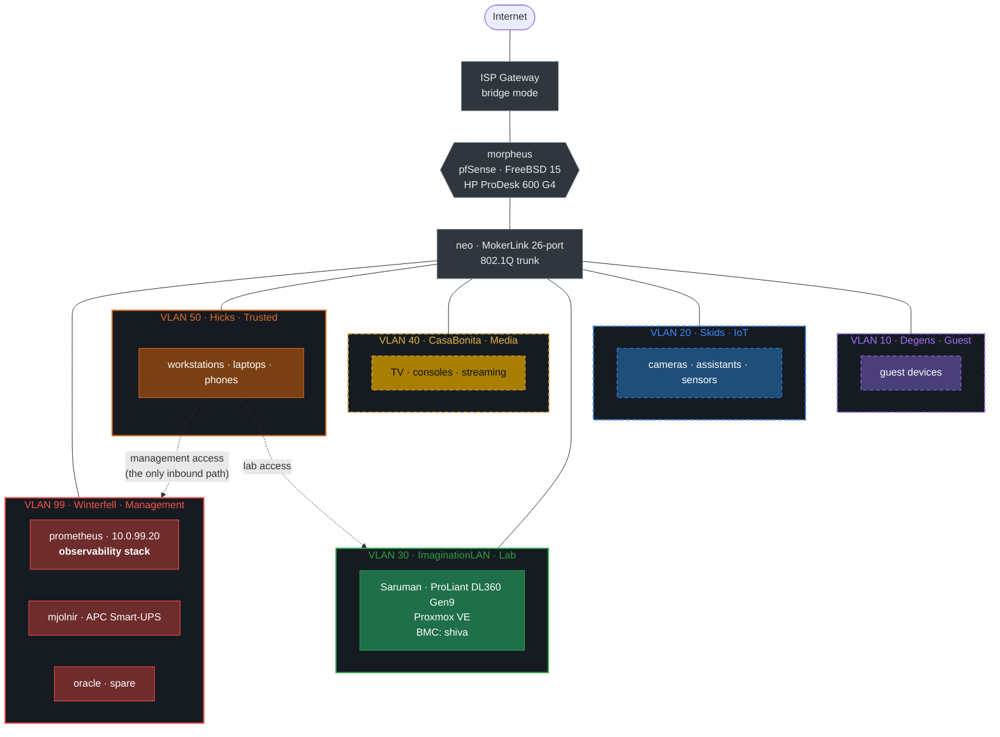
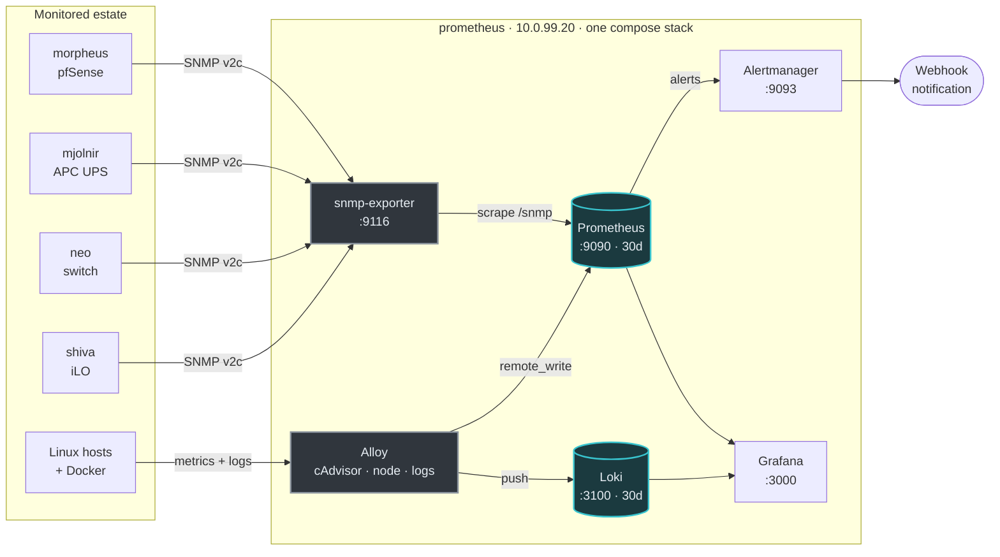

# Architecture

## Network topology

Every segment terminates on pfSense. There is no route between segments unless a
rule creates one, and only two such rules exist.

Everything reaches the internet. Nothing reaches anything else, with two
exceptions drawn as dotted lines above: trusted workstations may administer
management, and may reach the lab. IoT, media and guest are terminal — traffic
goes out, nothing comes back in.

Segment colour is the patch-cable colour in the rack, so the diagram and the
hardware can be read against each other. A dashed border marks a terminal
segment. Grey is not a segment: the gateway, firewall and switch carry every
VLAN at once. Reasoning in
[ADR-0009](adr/0009-colour-vlans-by-cable-not-by-trust.md).

The full device inventory is in [`network.md`](network.md); the reasoning behind
the split is in [`security.md`](security.md).

## Observability data flow

Two collection paths, because the estate has two kinds of device:

- **Things that run an agent.** Linux hosts get a Grafana Alloy agent, which
  gathers node metrics, cAdvisor container metrics, the systemd journal, syslog
  and `auth.log`, then pushes to Loki and remote-writes to Prometheus. The same
  `config.alloy` runs everywhere; only two environment variables differ.
- **Things that cannot.** The firewall, switch, UPS and BMC are polled over SNMP
  through `snmp-exporter`, which Prometheus scrapes as a proxy.

Remote-write rather than scrape for agents means a new host appears in
Prometheus as soon as its agent starts — no target list to edit, no firewall
hole from the monitoring VLAN into the monitored one.

## Host and stack mapping

| Host | VLAN | Stack | Contents |
| --- | --- | --- | --- |
| `prometheus` (10.0.99.20) | 🔴 99 | [`stacks/observability`](../stacks/observability) | Prometheus, Alertmanager, Loki, Grafana, snmp-exporter, blackbox-exporter, Alloy |
| `Saruman` (10.0.30.110) | 🟢 30 | *(none yet)* | Proxmox VE 9.2.11, no guests — see [roadmap](roadmap.md) |
| `oracle` (10.0.99.30) | 🔴 99 | *(none yet)* | Undecided |

One directory per stack, not one per service. A stack is the unit that gets
deployed together; a second host means a second directory under `stacks/`, not a
re-shard of everything. Reasoning in
[ADR-0004](adr/0004-one-compose-stack-per-host.md).

## Ports

| Service | Port | Bound to | Notes |
| --- | --- | --- | --- |
| Grafana | 3000 | `${BIND_ADDR}` | The only UI meant to be opened by a human |
| Prometheus | 9090 | `${BIND_ADDR}` | Also the remote-write receiver for agents |
| Loki | 3100 | `${BIND_ADDR}` | Push endpoint for agents |
| Alertmanager | 9093 | `${BIND_ADDR}` | |
| Alloy | 12345 | `127.0.0.1` | Debug UI, deliberately not exposed |
| Alloy syslog | 1514/udp | `${BIND_ADDR}` | Network syslog receiver — pfSense pushes here |
| snmp-exporter | 9116 | *compose network only* | Never published to a host interface |
| blackbox-exporter | 9115 | *compose network only* | Never published — an open prober is an SSRF primitive |

`BIND_ADDR` defaults to `0.0.0.0` and is set in `.env`. Setting it to the host's
VLAN 99 address confines the whole stack to the management segment; the
published ports exist because agents on other hosts need to reach Prometheus and
Loki.

## Reference diagrams

The Mermaid diagrams above are the maintained ones — they render on GitHub, diff
as text, and cannot drift out of sync with the repo without a visible change.

- [Current topology export](diagrams/current/matrix_elysium.png) — detailed
  physical drawing, 9871×4466. Its editable `.drawio` source was lost in an
  earlier commit, which is a large part of why the diagrams above are Mermaid.
  **It predates the rack colour scheme and cannot be recoloured** — with no
  source file there is nothing to edit. Treat the Mermaid diagrams and
  [`network.md`](network.md) as authoritative for colour; this one is
  authoritative only for physical layout.
- [Previous topology](diagrams/previous/Network_Diagram.png)
