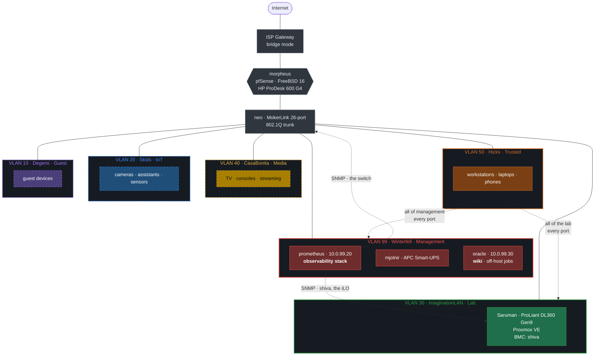
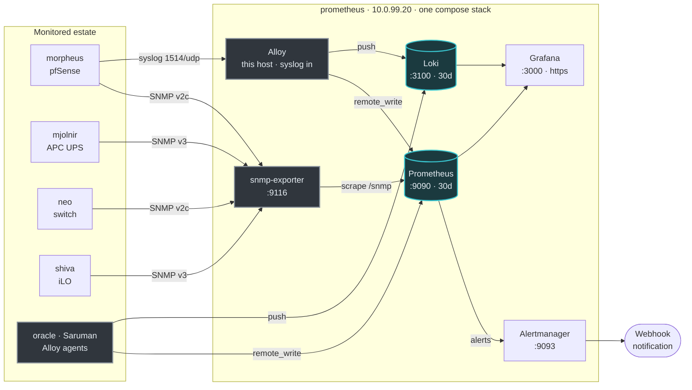

# Architecture

## Network topology

Every segment terminates on pfSense. Nothing crosses from one segment to another
unless a rule on the firewall lets it, and what each segment can reach is
recorded per segment — the *Reaches* column in [`network.md`](network.md) — not
as a count of rules. [ADR-0013](adr/0013-segment-access-as-implemented.md)
explains why the count was the wrong description.

```mermaid
graph TB
    INET([Internet])
    GW[ISP Gateway<br/>bridge mode]
    FW{{"morpheus<br/>pfSense · FreeBSD 16<br/>HP ProDesk 600 G4"}}
    SW[neo · MokerLink 26-port<br/>802.1Q trunk]

    INET --- GW --- FW --- SW

    subgraph V99["VLAN 99 · Winterfell · Management"]
        MON["prometheus · 10.0.99.20<br/><b>observability stack</b>"]
        UPS["mjolnir · APC Smart-UPS"]
        WIKI["oracle · 10.0.99.30<br/><b>wiki</b> · off-host jobs"]
    end

    subgraph V50["VLAN 50 · Hicks · Trusted"]
        WS["workstations · laptops · phones"]
    end

    subgraph V40["VLAN 40 · CasaBonita · Media"]
        TV["TV · consoles · streaming"]
    end

    subgraph V30["VLAN 30 · ImaginationLAN · Lab"]
        HV["Saruman · ProLiant DL360 Gen9<br/>Proxmox VE<br/>BMC: shiva"]
    end

    subgraph V20["VLAN 20 · Skids · IoT"]
        IOT["cameras · assistants · sensors"]
    end

    subgraph V10["VLAN 10 · Degens · Guest"]
        GUEST["guest devices"]
    end

    SW --- V99
    SW --- V50
    SW --- V40
    SW --- V30
    SW --- V20
    SW --- V10

    WS -.->|"all of management<br/>every port"| V99
    WS -.->|"all of the lab<br/>every port"| V30
    MON -.->|"SNMP · shiva, the iLO"| HV
    MON -.->|"SNMP · the switch"| SW

    %% Fill is the patch-cable colour in the rack — see network.md, ADR-0009.
    %% A dashed border marks a terminal segment: traffic goes out, nothing
    %% comes back in. Grey is not a segment; it carries every VLAN.
    %% stroke-dasharray must be last on its line and space-separated — a comma
    %% is the property delimiter and would truncate the value.
    classDef vlan99 fill:#6e2c2c,stroke:#f85149,color:#fff
    classDef vlan50 fill:#7a3f12,stroke:#db6d28,color:#fff
    classDef vlan30 fill:#1f6f4a,stroke:#2ea043,color:#fff
    classDef infra  fill:#30363d,stroke:#8b949e,color:#e6edf3
    classDef vlan40 fill:#a87f00,stroke:#e3b341,color:#0d1117,stroke-dasharray: 6 4
    classDef vlan20 fill:#1f4e79,stroke:#388bfd,color:#fff,stroke-dasharray: 6 4
    classDef vlan10 fill:#4a3f7a,stroke:#a371f7,color:#fff,stroke-dasharray: 6 4

    class MON,UPS,WIKI vlan99
    class WS vlan50
    class HV vlan30
    class TV vlan40
    class IOT vlan20
    class GUEST vlan10
    class GW,FW,SW infra

    %% classDef is unreliable on subgraphs (mermaid-js/mermaid#1726), so the
    %% clusters are styled explicitly and the dash is applied to their inner
    %% nodes as well — the cue survives either way.
    style V99 fill:#161b22,stroke:#f85149,stroke-width:2px,color:#f85149
    style V50 fill:#161b22,stroke:#db6d28,stroke-width:2px,color:#db6d28
    style V30 fill:#161b22,stroke:#2ea043,stroke-width:2px,color:#2ea043
    style V40 fill:#161b22,stroke:#e3b341,stroke-width:2px,color:#e3b341,stroke-dasharray: 6 4
    style V20 fill:#161b22,stroke:#388bfd,stroke-width:2px,color:#388bfd,stroke-dasharray: 6 4
    style V10 fill:#161b22,stroke:#a371f7,stroke-width:2px,color:#a371f7,stroke-dasharray: 6 4
```

Everything reaches the internet. The dotted lines are the paths that cross a
segment boundary. Trusted workstations reach management on a named list — SSH
to every host, the firewall's UI, DNS, NTP, ping, the wiki, Grafana and the UPS
card — above a logged block that drops the rest, and reach all of the lab by a
rule that says so ([ADR-0031](adr/0031-narrow-hicks-to-a-named-list-on-winterfell-and-leave-the-lab-open.md), decided
under [#228](https://github.com/Gerrrt/HomeLab/issues/228)). The
observability host polls the iLO and the switch over SNMP; the switch has a
return-path rule, and the iLO's replies ride pf state alone since the rule that
duplicated it was deleted on 2026-09-09
([ADR-0033](adr/0033-keep-the-ilo-on-the-lab-segment.md)). Everything else is
default deny. IoT, media and guest are
terminal — traffic goes out, nothing comes back in. One path the diagram cannot
draw: the switch is plumbing here, not a segment, but its management address
sits on the untagged LAN (`10.7.7.0/24`), and that interface still carries
pfSense's stock *Default allow LAN to any* rule, so the switch reaches every
segment ([#229](https://github.com/Gerrrt/HomeLab/issues/229)).

Segment colour is the patch-cable colour in the rack, so the diagram and the
hardware can be read against each other. A dashed border marks a terminal
segment. Grey is not a segment: the gateway, firewall and switch carry every
VLAN at once. Reasoning in
[ADR-0009](adr/0009-colour-vlans-by-cable-not-by-trust.md).

The full device inventory is in [`network.md`](network.md); the reasoning behind
the split is in [`security.md`](security.md).

## Observability data flow

```mermaid
graph LR
    subgraph Sources["Monitored estate"]
        direction TB
        PF["morpheus<br/>pfSense"]
        UPSD["mjolnir<br/>APC UPS"]
        SWD["neo<br/>switch"]
        ILO["shiva<br/>iLO"]
        AGENTS["oracle · Saruman<br/>Alloy agents"]
    end

    subgraph Stack["prometheus · 10.0.99.20 · one compose stack"]
        direction TB
        SNMP["snmp-exporter<br/>:9116"]
        ALLOY["Alloy<br/>this host · syslog in"]
        PROM[("Prometheus<br/>:9090 · 30d")]
        LOKI[("Loki<br/>:3100 · 30d")]
        AM["Alertmanager<br/>:9093"]
        GRAF["Grafana<br/>:3000 · https"]
    end

    OUT([Webhook<br/>notification])

    PF -->|SNMP v2c| SNMP
    UPSD -->|SNMP v3| SNMP
    SWD -->|SNMP v2c| SNMP
    ILO -->|SNMP v3| SNMP
    PF -->|syslog 1514/udp| ALLOY
    AGENTS -->|remote_write| PROM
    AGENTS -->|push| LOKI

    SNMP -->|scrape /snmp| PROM
    ALLOY -->|remote_write| PROM
    ALLOY -->|push| LOKI
    PROM -->|alerts| AM
    AM --> OUT
    PROM --> GRAF
    LOKI --> GRAF

    %% Deliberately outside the VLAN palette — this diagram is about data
    %% paths, not segments, and reusing a cable colour here would read as a
    %% claim about which segment a component is on. Grey means the same thing
    %% in both diagrams: plumbing. No dashes — that means "terminal" now.
    classDef store fill:#1b3a3f,stroke:#39c5cf,color:#e6edf3,stroke-width:2px
    classDef agent fill:#30363d,stroke:#8b949e,color:#e6edf3,stroke-width:2px
    class PROM,LOKI store
    class SNMP,ALLOY,AGENTS agent
```

Two collection paths, because the estate has two kinds of device:

- **Things that run an agent.** Linux hosts get a Grafana Alloy agent, which
  gathers node metrics, cAdvisor container metrics, the systemd journal, syslog
  and `auth.log`, then pushes to Loki and remote-writes to Prometheus. The same
  `alloy/` directory runs everywhere — `config.alloy` on every host,
  `docker.alloy` where there is a Docker socket, `syslog.alloy` only here — and
  `scripts/deploy-agent.sh` ships the right subset, in a container or as the
  native package; only the endpoint variables differ.
- **Things that cannot.** The firewall, switch, UPS and BMC are polled over SNMP
  through `snmp-exporter`, which Prometheus scrapes as a proxy.

Remote-write rather than scrape for agents means a new host appears in
Prometheus as soon as its agent starts — no target list to edit, no firewall
hole from the monitoring VLAN into the monitored one.

## Host and stack mapping

| Host | VLAN | Stack | Contents |
| --- | --- | --- | --- |
| `prometheus` (10.0.99.20) | 🔴 99 | [`stacks/observability`](../stacks/observability) | Prometheus, Alertmanager, Loki, Grafana, snmp-exporter, blackbox-exporter, docker-socket-proxy, Alloy |
| `Saruman` (10.0.30.110) | 🟢 30 | *(none — and none intended)* | Proxmox VE 9, hosting eleven guests: `alexander`, built 2026-09-05 ([#262](https://github.com/Gerrrt/HomeLab/issues/262)); `phoenix`, built 2026-09-20 ([#436](https://github.com/Gerrrt/HomeLab/issues/436)); `odin`, built 2026-09-27 for the security tooling (ADR-0030); `fenrir`, built 2026-09-30 as the Zeek sensor ([#437](https://github.com/Gerrrt/HomeLab/issues/437)); `golem`, built 2026-10-03 as the backup server ([#485](https://github.com/Gerrrt/HomeLab/issues/485)); and ADR-0029's six-machine domain, built by hand 2026-09-24 to 2026-09-25 ([#414](https://github.com/Gerrrt/HomeLab/issues/414)), of which `carbuncle` and `siren` run per session. Alloy agent (native package). It runs no compose stack by decision, not by omission: Docker would rewrite the iptables its own firewall relies on ([ADR-0014](adr/0014-put-ifrit-on-imaginationlan-and-give-the-targets-no-route.md)), which is why the agent here is the native package and why `stacks/lab` runs in a guest |
| `alexander` (10.0.30.40) | 🟢 30 | [`stacks/lab`](../stacks/lab) | Prometheus, Loki, Grafana, Alloy and its Docker socket proxy, and Caddy as the ingest proxy in front of the first two ([#834](https://github.com/Gerrrt/HomeLab/issues/834)) — the lab's own observability, which never remote-writes to VLAN 99 ([ADR-0007](adr/0007-defensive-estate-and-offensive-range.md), [ADR-0020](adr/0020-run-the-lab-stack-in-a-guest-with-its-own-prometheus.md)). A guest on `Saruman`, not the hypervisor; Alloy agent (Docker) |
| `odin` (10.0.30.60) | 🟢 30 | [`stacks/soc`](../stacks/soc) | Wazuh (indexer, manager, dashboard), Velociraptor and Alloy: the security half of ADR-0007, placed by [ADR-0030](adr/0030-give-the-security-tooling-its-own-guest-and-its-own-stack.md) on a second guest on `Saruman` because `alexander`'s 8 GiB cannot hold both. Built 2026-09-27 by [`build-the-soc-guest.md`](runbooks/build-the-soc-guest.md), the stack authored and CI-validated ahead of the guest the way `stacks/lab` was ahead of `alexander` ([#266](https://github.com/Gerrrt/HomeLab/issues/266), [#267](https://github.com/Gerrrt/HomeLab/issues/267)); the six domain machines enrol as agents by GPO, which is the day those two issues close. Its Alloy pushes to `alexander`, never to VLAN 99, and the indexer's health is the one series that crosses into the lab's Prometheus. Alloy agent (Docker) |
| `fenrir` (10.0.30.90) | 🟢 30 | [`stacks/sensor`](../stacks/sensor) | Zeek on a `tc` mirror of `Saruman`'s lab bridge, so that the domain's east-west traffic, which crosses no router and so never reaches Suricata on `morpheus`, is observed at all ([#437](https://github.com/Gerrrt/HomeLab/issues/437), [ADR-0068](adr/0068-mirror-the-lab-bridge-to-zeek-with-tc-not-open-vswitch.md)). A guest on `Saruman`, VMID 190, with a second NIC alone on the port-less `vmbr1` that receives only the mirror's copies. Its logs go to `alexander`, never to VLAN 99; whether the mirror is delivering is answered on the hypervisor by `homelab_zeek_mirror_active`. Built 2026-09-30 by [`build-the-sensor-guest.md`](runbooks/build-the-sensor-guest.md), and proved by rebooting `Saruman` with the mirror's timer disabled: the gauge fell to 0 and `ZeekMirrorInactive` fired. Alloy agent (Docker) |
| `diabolos` (10.0.30.61) | 🟢 30 | [`stacks/scratch`](../stacks/scratch) | **Not built yet**, and torn down between investigations: a DISPOSABLE copy of `stacks/soc` (Wazuh and Velociraptor on the same digests, soc's config mounted unchanged) for detonations and one-off questions, so that noise never spends `odin`'s shard budget or enters its record ([#438](https://github.com/Gerrrt/HomeLab/issues/438), [ADR-0071](adr/0071-run-disposable-investigations-on-a-guest-that-is-destroyed.md)). A guest on `Saruman`, VMID 161, created with the Proxmox tag `disposable`; the hypervisor's guest-state collector reports the tag and the guest's age, and `DisposableGuestOutlived` fires on the estate when it has existed for a fortnight, running or stopped. No Alloy, no scrape, no backup and no committed secrets: its age key and `secrets/scratch.sops.yaml` are made on the guest and destroyed with it. Built and destroyed by [`run-a-scratch-investigation.md`](runbooks/run-a-scratch-investigation.md) |
| `phoenix` (10.0.30.70) | 🟢 30 | *(none — a toolchain host, no Docker)* | The deployment host, built 2026-09-20: a Proxmox API token, an SSH key and a checkout, so that the Packer, OpenTofu and Ansible work after [#436](https://github.com/Gerrrt/HomeLab/issues/436) has somewhere to run from. A guest on `Saruman`, placed by [ADR-0043](adr/0043-keep-the-ca-on-prometheus-and-build-phoenix-as-the-deployment-host.md), which also decides that the estate's CA key stays on `prometheus` and does not follow the toolchain here. It holds no age key and runs no continuous convergence (what it configures, it configures on demand, below); it is the WireGuard endpoint of [ADR-0042](adr/0042-terminate-the-remote-path-on-the-lab-and-route-it.md), built 2026-09-22 ([#442](https://github.com/Gerrrt/HomeLab/issues/442)); the one thing it is meant to reach that no other guest does is `8006` on `Saruman`, by a single host-firewall rule — written 2026-09-20, when [#566](https://github.com/Gerrrt/HomeLab/issues/566) enabled the firewall the build had found disabled and narrowed the `local_network` alias that was admitting the whole segment underneath it. Its Alloy pushes to `alexander`, never to VLAN 99; the build is [`build-the-jumpbox.md`](runbooks/build-the-jumpbox.md). The first toolchain on it is [`packer/`](../packer/README.md), the lab's VM templates at VMIDs 901–912 ([ADR-0074](adr/0074-build-the-lab-templates-with-packer-from-phoenix.md), [`build-the-lab-templates.md`](runbooks/build-the-lab-templates.md)). The second is [`ansible/`](../ansible/README.md), which configures ADR-0029's six over SSH and touches nothing else ([ADR-0077](adr/0077-configure-the-lab-domain-with-ansible-from-phoenix.md), [#448](https://github.com/Gerrrt/HomeLab/issues/448)). Alloy agent (native package, `scripts/deploy-agent.sh`) |
| `golem` (10.0.30.80) | 🟢 30 | *(none — an appliance, no Docker)* | Proxmox Backup Server 4.2, built 2026-10-03 by [`build-the-backup-guest.md`](runbooks/build-the-backup-guest.md) ([#485](https://github.com/Gerrrt/HomeLab/issues/485)): the lab's backups, placed by [ADR-0053](adr/0053-run-pbs-on-saruman-with-its-datastore-on-smaug-over-nfs.md). A guest on `Saruman`, VMID 180, whose only datastore, `erebor`, is `smaug`'s `erebor/pbs` over NFSv4 through one `2049` pass, with `atime` on because garbage collection depends on it, and the mountpoint made immutable so an unmounted share cannot fill the OS disk. Every backup is encrypted on `Saruman` before it leaves, with a key made on `Saruman` and copied, on 2026-10-03, into `secrets/lab.sops.yaml` and onto paper (the runbook's §7), so a lost `Saruman` does not take the backups' readability with it; `Saruman` writes through a token that can back up and cannot prune. PBS prunes (7 daily, 4 weekly, 3 monthly), collects garbage on Saturdays and verifies on Sundays; TrueNAS keeps fourteen daily snapshots of the dataset as the copy PBS cannot prune. The nightly job takes `odin` and the domain's six; `alexander`, `phoenix`, `fenrir` and `golem` itself are rebuilt from this repository and stay out. The collector that reports verify, prune and garbage-collection outcomes, and the first nightly backup verified, are what keep #485 open. Its Alloy pushes to `alexander`, never to VLAN 99, since 2026-10-03. Alloy agent (native package, `scripts/deploy-agent.sh`) |
| `oracle` (10.0.99.30) | 🔴 99 | [`stacks/wiki`](../stacks/wiki) | The Lemmiwinks wiki and its Postgres, since 2025-11-12 ([ADR-0011](adr/0011-keep-the-wiki-internal.md)), hand-run containers until [#251](https://github.com/Gerrrt/HomeLab/issues/251) wrote them down as a stack deployed by hand from `main`, like `smaug`'s; its database is pulled to `prometheus` nightly as a `pg_dump` (`make backup-wiki`, [ADR-0065](adr/0065-pull-the-wikis-database-to-prometheus-as-a-dump.md)); Alloy agent (Docker, `scripts/deploy-agent.sh`); the off-host copies of the firewall export (`make backup-firewall`), of the weekly volume sets (`make backup`, [#535](https://github.com/Gerrrt/HomeLab/issues/535)) and of the media tier's state pulled off `smaug` (`make backup-nas`, [ADR-0045](adr/0045-pull-jellyfins-state-from-a-snapshot-over-ssh.md)). The estate's host for small off-host jobs — [ADR-0015](adr/0015-give-oracle-the-off-host-jobs.md) |
| `trinity` (10.0.99.40) | 🔴 99 | [`stacks/sensitive`](../stacks/sensitive) | ADR-0008's sensitive tier on the ProDesk 600 G4 of [ADR-0034](adr/0034-run-the-sensitive-tier-on-the-prodesk-and-make-it-the-spare-hardware.md). **Built and deployed 2026-09-28** ([#404](https://github.com/Gerrrt/HomeLab/issues/404), [`build-the-sensitive-tier-host.md`](runbooks/build-the-sensitive-tier-host.md)): Ubuntu 26.04 with both disks LUKS-encrypted and the root unlocked by the TPM ([ADR-0054](adr/0054-encrypt-trinitys-disks-and-seal-the-root-key-to-the-tpm.md)), all twelve containers healthy, and since that day AdGuard is the one forwarder behind `morpheus`'s resolver ([ADR-0055](adr/0055-forward-to-adguard-alone.md)). Holding real data since 2026-09-28, Immich's first 615 photographs, which passed the #404 step 10 gate while most of it was open. The library is copied nightly to `oracle`, off-host and not off-estate, until [#455](https://github.com/Gerrrt/HomeLab/issues/455) ([ADR-0064](adr/0064-copy-immichs-library-to-oracle-until-the-off-estate-copy-exists.md)). The stack: Caddy as the published HTTPS port and step-ca issuing beneath the tier's own root rather than the estate's, which is left untouched ([#129](https://github.com/Gerrrt/HomeLab/issues/129), [#130](https://github.com/Gerrrt/HomeLab/issues/130), [ADR-0037](adr/0037-give-the-sensitive-tier-its-own-root-and-issue-beneath-it-over-acme.md)), with AdGuard Home behind Caddy and publishing 53 to the firewall's forwarder alone ([#135](https://github.com/Gerrrt/HomeLab/issues/135), [ADR-0010](adr/0010-keep-the-resolver-on-the-gateway.md)); Home Assistant ([#134](https://github.com/Gerrrt/HomeLab/issues/134)), Immich — four containers behind Caddy with a memory limit on each ([#132](https://github.com/Gerrrt/HomeLab/issues/132)) — Paperless-ngx with a Postgres and a Valkey of its own ([#133](https://github.com/Gerrrt/HomeLab/issues/133)) and Vaultwarden ([#131](https://github.com/Gerrrt/HomeLab/issues/131)) run beside them, with Homepage at `home.matrix.elysium` as the household's page of links to them, its three live tiles on read-only tokens ([#137](https://github.com/Gerrrt/HomeLab/issues/137)). ntfy ([#136](https://github.com/Gerrrt/HomeLab/issues/136)) is the in-house receiver for Alertmanager's three real channels, **deployed and cut over 2026-09-29** by [`verify-the-alert-path.md`](runbooks/verify-the-alert-path.md#cutting-over-to-the-in-house-ntfy), with `urgent` and `security` also sent to ntfy.sh for a phone away from home. Miniflux, a feed reader with a Postgres of its own, is the tier's first service beyond ADR-0008's nine, **deployed 2026-09-29** ([#147](https://github.com/Gerrrt/HomeLab/issues/147), [ADR-0057](adr/0057-add-miniflux-to-the-sensitive-tier-with-its-fetcher-kept-off-winterfell.md)): the one container here that reaches outward on a timer, with its fetcher refused every private address. Memos, the household's notes, is the second, decided by [ADR-0059](adr/0059-add-memos-to-the-sensitive-tier-for-notes-and-keep-documentation-in-docs.md) ([#145](https://github.com/Gerrrt/HomeLab/issues/145)) and deployed behind Caddy the same day, all sixteen containers healthy after that `make up`. Neither holds real data yet. Mealie, the household's recipes at `recipes.matrix.elysium`, is the third, **deployed 2026-09-29** ([#146](https://github.com/Gerrrt/HomeLab/issues/146), [ADR-0060](adr/0060-add-mealie-to-the-sensitive-tier-as-recipes.md)), behind the same Caddy with no new rule, its URL import refused every private address. linkding, a bookmark manager, is the fourth, **deployed 2026-09-29** ([#144](https://github.com/Gerrrt/HomeLab/issues/144), [ADR-0061](adr/0061-add-linkding-to-the-sensitive-tier-behind-one-factor.md)). Actual ([#142](https://github.com/Gerrrt/HomeLab/issues/142)), the household's budget, is the fifth beyond ADR-0008's nine, **deployed 2026-09-29** ([ADR-0062](adr/0062-add-actual-to-the-sensitive-tier.md)), claimed from SOPS before its first start. It holds no real budget before #404 step 10. Stirling-PDF, the household's PDF editor at `pdf.matrix.elysium`, is the sixth, **deployed 2026-09-29** ([#143](https://github.com/Gerrrt/HomeLab/issues/143), [ADR-0063](adr/0063-add-stirling-pdf-to-the-sensitive-tier-and-keep-its-documents-in-memory.md)): its documents live on a tmpfs and never reach a disk. Alloy agent (Docker, `scripts/deploy-agent.sh`), pushing to `prometheus` like `oracle`'s |
| `smaug` (10.0.40.30) | 🟡 40 | [`stacks/media`](../stacks/media) | [ADR-0008](adr/0008-place-services-by-data-trust.md)'s media tier on the ThinkServer TS150 of [#413](https://github.com/Gerrrt/HomeLab/issues/413), placed and addressed by [ADR-0016](adr/0016-open-casabonita-inward-and-keep-it-terminal-outward.md) and running TrueNAS rather than Ubuntu Server by [ADR-0040](adr/0040-run-truenas-on-smaug-and-keep-the-media-stack-in-this-repository.md). **Built, pooled and deployed**: TrueNAS on its boot SSD, the static above since 2026-09-16, the four inbound rules verified in position, the mirror `erebor` since 2026-09-18 and this stack running on it since 2026-09-19 — from a copy of the compose file on the pool, brought up with `docker compose` under TrueNAS's own Docker ([`build-the-nas.md`](runbooks/build-the-nas.md) §6). Jellyfin, publishing 8096 to the segment because the televisions reach it natively and no firewall rule is involved at all ([#138](https://github.com/Gerrrt/HomeLab/issues/138)); and Audiobookshelf on 13378, **deployed 2026-09-29**, whose clients are phones on Hicks and which therefore brought a fifth inbound rule by ADR-0050's count, the seventh to exist ([#140](https://github.com/Gerrrt/HomeLab/issues/140), [ADR-0050](adr/0050-add-audiobookshelf-to-the-media-tier-behind-a-fifth-hicks-pass.md)). And Navidrome on 4533 for music, **deployed 2026-09-30** on the same terms, whose Hicks pass was created 2026-09-22, ahead of the service and of Audiobookshelf's ([#141](https://github.com/Gerrrt/HomeLab/issues/141)). The `media` share gets a Hicks pass on `445` for workstations, used by a second SMB user, `samwise`, so the televisions' `bilbo` stays theirs; it was **created on 2026-09-23** ([#523](https://github.com/Gerrrt/HomeLab/issues/523), [ADR-0051](adr/0051-let-hicks-workstations-mount-the-media-share-as-a-user-of-their-own.md)). Scraped by `prometheus` on `9100`; it pushes nothing, and runs no Alloy — the estate's first scraped host, and the reason [#256](https://github.com/Gerrrt/HomeLab/issues/256) was more than a line of YAML. That issue settled the fork TrueNAS opened in it: `node_exporter`, as a digest-pinned container in this stack rather than TrueNAS's own endpoint, so the existing `99 → 40:9100` pass, the `host-overview` dashboard and seven rules in `host.rules.yaml` all keep working unchanged. The `node` job and `prometheus/targets/node.yaml` are live, and the target with them since 2026-09-19, once the exporter answered from the pool. SMART reaches the same scrape by [ADR-0047](adr/0047-collect-smaug-smart-through-a-root-cron-and-the-textfile-collector.md): a root cron job in TrueNAS's UI runs the estate's collector and the exporter serves the file — still no agent, still nothing initiating from 40 — and patch state is deliberately not collected on an appliance ([#483](https://github.com/Gerrrt/HomeLab/issues/483)) |
| `bahamut` (10.0.30.50) | 🟢 30 | *(none — Windows)* | Windows Server 2025 domain controller, PDC emulator and DNS for `ad.matrix.elysium` — Tier 0. Static, because every member finds a DC through DNS and the DCs *are* the DNS. Built by hand 2026-09-24 to 2026-09-25 ([#414](https://github.com/Gerrrt/HomeLab/issues/414)) and promoted for `ad.matrix.elysium`. Scraped by `alexander` on `9182`; it pushes nothing, and runs no Alloy ([ADR-0029](adr/0029-size-the-lab-domain-and-separate-its-namespace-and-clock.md)) |
| `leviathan` (10.0.30.51) | 🟢 30 | *(none — Windows)* | Windows Server 2025 second domain controller and DNS — Tier 0. Static, for the same reason. Built by hand 2026-09-24 to 2026-09-25 ([#414](https://github.com/Gerrrt/HomeLab/issues/414)) and promoted for `ad.matrix.elysium`. Scraped by `alexander` on `9182`; it pushes nothing, and runs no Alloy ([ADR-0029](adr/0029-size-the-lab-domain-and-separate-its-namespace-and-clock.md)) |
| `titan` (10.0.30.52) | 🟢 30 | *(none — Windows)* | Windows Server 2025 file and member server — the shares, and the NTLM relay target that only exists because 2025 requires outbound SMB signing and not inbound — Tier 1. Built by hand 2026-09-24 to 2026-09-25 ([#414](https://github.com/Gerrrt/HomeLab/issues/414)) and joined to `ad.matrix.elysium`. Scraped by `alexander` on `9182`; it pushes nothing, and runs no Alloy ([ADR-0029](adr/0029-size-the-lab-domain-and-separate-its-namespace-and-clock.md)) |
| `ramuh` (10.0.30.53) | 🟢 30 | *(none — Windows)* | Windows Server 2025 application server — the service account with an SPN on a real service, so Kerberoasting has something to roast — Tier 1. Built by hand 2026-09-24 to 2026-09-25 ([#414](https://github.com/Gerrrt/HomeLab/issues/414)) and joined to `ad.matrix.elysium`. Scraped by `alexander` on `9182`; it pushes nothing, and runs no Alloy ([ADR-0029](adr/0029-size-the-lab-domain-and-separate-its-namespace-and-clock.md)) |
| `carbuncle` (10.0.30.54) | 🟢 30 | *(none — Windows)* | Windows 11 Pro endpoint — Tier 2, installed and activated on a purchased key (reported 2026-09-26). Runs per session, not continuously. Joined to `ad.matrix.elysium` by [`build-the-lab-domain.md`](runbooks/build-the-lab-domain.md) ([#414](https://github.com/Gerrrt/HomeLab/issues/414)). Scraped by `alexander` on `9182`; it pushes nothing, and runs no Alloy ([ADR-0029](adr/0029-size-the-lab-domain-and-separate-its-namespace-and-clock.md)) |
| `siren` (10.0.30.55) | 🟢 30 | *(none — Windows)* | Windows 11 Pro endpoint — Tier 2, installed and activated on a purchased key (reported 2026-09-26). Runs per session, not continuously. Joined to `ad.matrix.elysium` by [`build-the-lab-domain.md`](runbooks/build-the-lab-domain.md) ([#414](https://github.com/Gerrrt/HomeLab/issues/414)). Scraped by `alexander` on `9182`; it pushes nothing, and runs no Alloy ([ADR-0029](adr/0029-size-the-lab-domain-and-separate-its-namespace-and-clock.md)) |

One directory per stack, not one per service. A stack is the unit that gets
deployed together; a second host means a second directory under `stacks/`, not a
re-shard of everything. Reasoning in
[ADR-0004](adr/0004-one-compose-stack-per-host.md).

## Ports

| Service | Port | Bound to | Notes |
| --- | --- | --- | --- |
| Grafana | 3000 | `${BIND_ADDR}` | The only UI meant to be opened by a human, and the only service that terminates TLS — `https://`, on a lab-CA certificate a browser will warn about until you trust `certificates/ca.pem` |
| Caddy (ingest proxy) | 9090 | `${INGEST_BIND_ADDR}` | Where the agents on `oracle`, `trinity` and `Saruman` remote-write, and where Homepage and Home Assistant query. A bearer token per client, and a path allowlist per role; see [ADR-0067](adr/0067-authenticate-the-ingest-ports-with-a-token-per-client.md) |
| Caddy (ingest proxy) | 3100 | `${INGEST_BIND_ADDR}` | Where the same agents push logs. Loki's delete API is refused to every token |
| Prometheus | 9090 | `127.0.0.1` | Unauthenticated, so loopback only; off-host clients come through the ingest proxy |
| Loki | 3100 | `127.0.0.1` | Unauthenticated, so loopback only; off-host clients come through the ingest proxy |
| Alertmanager | 9093 | `127.0.0.1` | Nothing off-host uses it; silences are reached through Grafana |
| Alloy | 12345 | `127.0.0.1` | Debug UI, deliberately not exposed |
| Alloy syslog | 1514/udp | `${BIND_ADDR}` | Network syslog receiver — pfSense pushes here |
| snmp-exporter | 9116 | *compose network only* | Never published to a host interface |
| blackbox-exporter | 9115 | *compose network only* | Never published — an open prober is an SSRF primitive |
| docker-socket-proxy | 2375 | *compose network only* | Never published — it holds the Docker socket, and an open one is root on this host |

A port is published only when something off this host uses it
([ADR-0012](adr/0012-publish-only-ports-with-an-off-host-consumer.md)). Grafana
is opened in a browser from Hicks, the syslog receiver takes pushes from
`morpheus`, and the ingest proxy takes metrics and logs from the Alloy agents
on `oracle`, `trinity` and `Saruman`. Alertmanager has no such client, so it
binds to `127.0.0.1`; silences are reached through Grafana, which proxies it
over the compose network behind a login.

A published port must also say what a client has to prove before it is served
([ADR-0067](adr/0067-authenticate-the-ingest-ports-with-a-token-per-client.md)).
Grafana wants a login. The ingest proxy wants a bearer token: one per agent,
which can push and do nothing else, and one reader token, which can query and
do nothing else. Neither role reaches Prometheus's admin API or Loki's delete
API. Prometheus and Loki themselves authenticate nothing, so they are published
on `127.0.0.1` only. That keeps the host's own timers and the runbooks'
`curl localhost:9090` working, and a local user on this host is past anything
a token could stop anyway.

`BIND_ADDR` governs Grafana and the syslog receiver. It defaults to `0.0.0.0`
and is set in `stacks/observability/.env.example` — `.env` is regenerated from
that file on every `make up`, so the committed value is the deployed one.
Setting it to the host's VLAN 99 address would confine them to the management
segment, which today changes nothing: the host has one interface and it is
already on VLAN 99.

`INGEST_BIND_ADDR` is the proxy's, and it is `10.0.99.20`, never a wildcard.
Docker cannot publish `0.0.0.0:9090` while Prometheus holds `127.0.0.1:9090`,
because a wildcard bind covers loopback.

## Reference diagrams

The Mermaid diagrams above render inline, diff as text, and cannot drift out
of sync with the repo without a visible change. The SVG below is the detailed
drawing, and it is text too.

- [Current network diagram](diagrams/current/network.svg) — the physical and
  logical drawing: rack, firewall, switch, and every addressed host by
  segment, in the rack colours. It is hand-written SVG, so it diffs as text
  and is edited in the same pull request as the `network.md` row it restates
  ([`diagrams/README.md`](diagrams/README.md)). Where the two disagree,
  [`network.md`](network.md) is right.
- [Previous topology export](diagrams/previous/matrix_elysium.png), 2025 —
  its editable source was lost, so it could never be corrected, and it
  predates the rack colour scheme, the household tier, the NAS and the lab
  guests. Kept for comparison.
- [Older topology](diagrams/previous/Network_Diagram.png)
